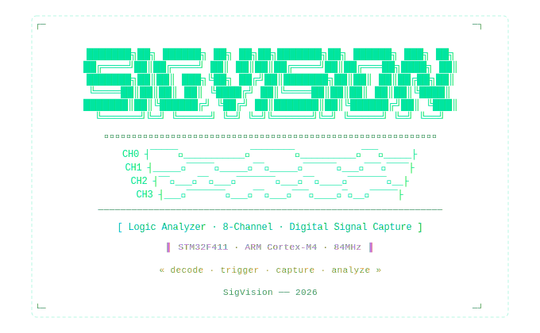

# SigVision — Logic Analyzer

  

  
  
  
  
  
  

 SigVision is a high-performance embedded logic analyzer built around the STM32F411 microcontroller. It provides 8 digital probe channels, configurable sampling rates, real-time signal acquisition, and a modular firmware architecture designed for low-level debugging, protocol analysis, and embedded systems experimentation.

## Features

- 8 Digital Channels — 8 independent acquisition channels via GPIO, with digital probe support for simultaneous monitoring of multiple signals

- 84 MHz Sampling Engine — Configurable sampling rate leveraging the STM32F411's maximum clock, enabling high-frequency signal capture with precision

- Real-Time Signal Acquisition — Continuous low-latency signal capture, suitable for protocol debugging and timing analysis

- Modular Firmware Architecture — Firmware structure designed for easy extension, allowing new protocols, triggers, and acquisition modes to be added

- Budget-Friendly — Accessible hardware based on the STM32F411, making professional logic analysis viable without expensive lab equipment
